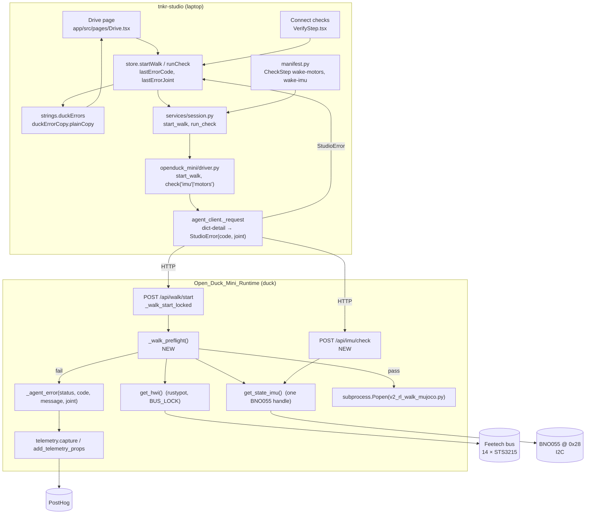
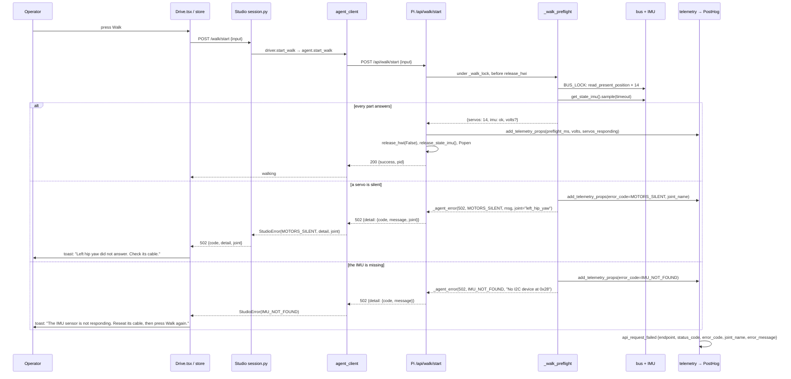

# Walk Pre-flight — Architecture

## Overview

A walk pre-flight is a hardware roll-call the Pi agent runs inside `POST /api/walk/start`,
before it spawns the walk subprocess: does the BNO055 IMU answer, does every one of the
fourteen servos answer, and what is the battery at. If a part is missing the agent refuses
with a coded error that names the part, and Studio turns that code into one operator
sentence. It sits between Studio's `start_walk` and the runtime's `subprocess.Popen` in
`scripts/tnkr_server.py`, and the same IMU probe becomes a Studio connect-time check next to
the existing motors check. Why now: an unplugged IMU cost seven crashed walks over three
days (2026-09-02 to 09-08) because the walk's constructor is the first code that touches
the IMU, its traceback exists only in the Pi's journal, and every layer above recorded the
failure as an absence: `exit_code: 1` on `walk_ended`, a rigid duck, and a keyboard that
did nothing.

## System Operation

**`_walk_preflight()` (runtime, new).** A function called from `_walk_start_locked`
(`scripts/tnkr_server.py:2928`) after the rehome and already-running guards and **before**
`release_hwi(disable_torque=False)` / `release_state_imu()` at `:2952-2958`. Ordering is
the whole design: at that point the server still owns both hardware handles, so the probe
reuses them. Constructing a second `BNO055_I2C` would soft-reset the chip and wipe the axis
remap, which is exactly what the comments at `:319-327` and `:2603` warn about. It holds
`BUS_LOCK` (an `RLock`, `rustypot_position_hwi.py:15`) across the servo roll-call so a
concurrent `/api/state` poll cannot interleave on the adapter.

**Servo roll-call.** The same per-servo read `/api/motors/check` uses
(`hwi.io.read_present_position([id])` through `_io_retry`, `tnkr_server.py:751-786`),
minus its gain write: the duck may be standing in its stance, and a pre-flight must not
touch gains or torque. A silent servo is reported by joint name; a bus that will not open
is a different failure and keeps its own code. The check's cost is dominated by absent
servos: the Feetech SDK's default packet timeout is about 34 ms per missing servo at
1 Mbaud, so a fully silent bus costs roughly half a second, a healthy one a few tens of ms.

**IMU probe.** `get_state_imu()` (`:317`) constructing or returning the shared handle.
One code, `IMU_NOT_FOUND`, for the constructor failing: nothing answers at 0x28
(`ValueError("No I2C device at address: 0x28")` from Blinka's probe) or something else
does (`RuntimeError("bad chip id")`). A chip that answers its identity check but then
yields no readings (the Raspberry Pi clock-stretching case, or a hung mode switch) is a
real but rarer state; it is **deferred** (decision 2026-09-09), see Alternatives. The
probe therefore does not wait on a sample, which also removes the false positive a freshly
constructed sensor would produce during its first second.

**Voltage.** Reported, never a gate. Studio already shows the band from `/api/voltage`.
The pre-flight attaches `volts` to the start request's telemetry when it can read it off
the bus it already holds; it does not open pypot (that path closes rustypot and costs up
to 2.5 s on a flaky bus, as measured on 2026-09-07). Thresholds stay where they are:
`VOLTAGE_LOW = 7.4`, `VOLTAGE_CRITICAL = 7.0` (`tnkr_server.py:3394`).

**`_agent_error` (runtime, existing).** The dict-detail protocol at `tnkr_server.py:930`:
`{"code", "message", "joint"?}` on an `HTTPException`. Pre-flight refusals use it with
502 for a part that is silent on a working bus and 503 for a bus that will not open, the
same split Studio's `ErrorCode` docstring insists on (`errors.py:107-113`).

**`POST /api/imu/check` (runtime, new).** The IMU half of the pre-flight exposed on its own,
shaped like `/api/motors/check`: 200 with `{"present": true, ...}` or the same coded 502.
It exists so Studio's connect-time `CheckStep` has something to call. An agent without it
returns 404, which `_STATUS_TO_CODE` already maps to `AGENT_OUTDATED`.

**`agent_client._request` (Studio, existing).** Already reads the dict detail and picks the
`ErrorCode` by name (`agent_client.py:196-260`). One extension: `joint` becomes a field on
`StudioError` instead of being folded into the log-only `detail`, so the snapshot can carry
it to the frontend. Today the comment there says the operator copy names the joint from the
screen's own state; a pre-flight refusal has no such screen, so the joint has to travel.

**`driver.check` and `manifest.py` (Studio, existing).** `VerifyKind` at `models.py:20`
gains `"imu"`; `driver.check` (`driver.py:533`) gains the branch; the duck manifest
(`manifest.py:75-83`) gains a second `CheckStep`. `test_duck_steps.py:39` pins the step
list and will need the new id.

**Copy (Studio, existing tables).** `strings.duckErrors` gets `IMU_NOT_FOUND` and a
duck-voiced `MOTORS_SILENT` (today the duck inherits the arm sentence, "Check the arm has
power"). Agreed sentences (2026-09-09):

| code | connect-time check (`strings.connect.duckErrors`) | Drive page (`strings.duckErrors`) |
|---|---|---|
| `IMU_NOT_FOUND` | The IMU sensor is not responding. Reseat its cable, then run the check again. | The IMU sensor is not responding. Reseat its cable, then press Walk again. |
| `MOTORS_SILENT` | {joint} did not answer the check. Reseat its cable, then run the check again. | {joint} did not answer. Check the cable into that servo. |

`duckErrorCopy.plainCopy` already substitutes `{joint}` with the manifest label. The two
vantage points differ because the connect screen has a check to re-run and the Drive page
does not. `VerifyStep.tsx:141-150` reads `strings.errors[code]` only; it has to consult
`duckErrors` for a network robot, or the new IMU check fails with arm copy on the one
screen built to show it.

## How Data Moves From One Stage to Another

**Stage 1, the press.** `store.startWalk` (`app/src/lib/store.ts:782`) never throws; it
records `lastErrorCode` and, after this work, `lastErrorJoint`. `Drive.tsx:504-510` reads
the code and toasts `duckErrors[code] ?? errors[code] ?? UNKNOWN` through `plainCopy` with
`jointLabel` from the manifest's joint table. Failure mode: a code with no `duckErrors`
entry falls to arm copy or to "Something went wrong"; `server/tests/test_error_copy.py`
fails the build for a code with no sentence.

**Stage 2, Studio to Pi.** `session.start_walk` (`services/session.py:1273`) already refuses
a pad walk with no joystick before calling the agent. The pre-flight is the agent-side
equivalent for the parts Studio cannot see. `agent_client.start_walk` (`:539`) sends
`{input, sessionToken?}`; the response path is `_request`. Failure modes: transport errors
keep their four existing codes; an older agent that lacks the pre-flight simply spawns as
today, so the Studio side must not assume the refusal exists.

**Stage 3, the pre-flight.** Runs under `_walk_lock`, before any handle is released, with
a hard budget (target under 1 s on a healthy duck, bounded at ~2 s with a silent bus; the
IMU probe is the constructor's own 0.75 s when the handle is fresh and ~0 when it is not). Order: servos first, because a bus that will not open makes the IMU
question moot and the operator's next move different. The probe never writes gains,
positions, or torque. On pass it returns a small dict the handler folds into telemetry.
On fail it calls `_agent_error` and the handler never reaches `Popen`. Failure modes: a
rustypot panic mid-probe is caught by `_io_retry` and reported as that joint silent; an
`Imu` constructor exception is caught and classified by type and message; anything the
classifier does not recognise becomes `SERVO_BUS_UNAVAILABLE` or `IMU_NOT_FOUND` with the
raw message in `error_message` for the developer, never on screen.

**Stage 4, refusal to sentence.** The dict detail crosses two HTTP hops unchanged in
meaning: Pi → Studio backend as `{code, message, joint}`, Studio backend → frontend as
`{code, detail, joint}`. The code is the hinge; the message is log-only on both sides. The
frontend resolves copy by code, substitutes the joint label, and shows one sentence.
Failure mode: `agent_client` treats an unknown code name as absent and falls back to the
status map (`_STATUS_TO_CODE`), so a runtime deployed ahead of Studio degrades to
`SERVO_BUS_UNAVAILABLE` on 502... which is wrong. The status for the new codes is 502 and
`_STATUS_TO_CODE` maps only 404/409/503, so an unknown 502 lands on `AGENT_FAILED`, whose
sentence points at the agent, not a cable. Acceptable for a version skew window; the fix is
to ship the Studio side first.

**Stage 5, telemetry.** No new event. The existing `api_request_failed` for
`/api/walk/start` carries `error_code` and `joint_name` as their own properties (the
`_note_calibration_fault` pattern at `tnkr_server.py:900`, chosen because a dict detail
stringified into `error_message` is not groupable). On success `api_request_completed`
carries `preflight_ms`, `servos_responding`, `imu_ok`, and `volts`. Failure mode: the
per-minute cap of 60 on `api_request_*` (`telemetry.py:52`) can drop a refusal during a
viewer-polling storm; the cap already excludes the successful `/api/state` polls that caused
that, so a refusal is unlikely to be the event that is dropped.

**Stage 6, connect-time IMU check.** `VerifyStep` runs the manifest's checks in order:
`wake-motors` then `wake-imu`. `driver.check("imu")` calls `POST /api/imu/check`; a 502 with
`IMU_NOT_FOUND` surfaces as a failed step with the duck sentence; a 404 from an older agent
surfaces as `AGENT_OUTDATED` with the existing upgrade sentence. The operator learns about
the cable at connect, the walk pre-flight remains the guard for a cable that came loose
after.

## Guardrails: what this work must not touch

The duck walks today because of Naveen's calibration chain (runtime PR #38
`feat/full-walking-setup`, Studio PR #166). That is the asset; the pre-flight is a guard
around it, not a change to it. Every story in this folder inherits these rules
(Jeremiah, 2026-09-09).

**Files the pre-flight never edits.**
- `scripts/v2_rl_walk_mujoco.py`: the walk itself. The whole design keeps the probe on the
  server side of the process boundary so this file stays as it is.
- `mini_bdx_runtime/rustypot_position_hwi.py`: `_io_retry`, the signs, the swapped pairs,
  `servo_ids`. The roll-call **calls** `hwi.io.read_present_position` through `_io_retry`;
  it adds nothing to the class.
- `mini_bdx_runtime/duck_config.py`, `CALIBRATION.md`, `example_config.json`.
- Every `/api/calibration/*`, `/api/directions/*`, `/api/identify/*`, swap and rehome route
  in `tnkr_server.py`, and `_agent_error` itself (reused as-is).
- Studio: the joint-calibration, leg-check and directions pages, `DuckSettings.tsx`, and the
  Drive page's live body and `CalibrationChip`. The Drive edit is confined to the
  `start()` toast at `Drive.tsx:504-510` (Jerry's code, verified by blame).

**Additive only in shared files.** `tnkr_server.py`, `driver.py`, `agent_client.py`,
`agent_types.py`, `sim_agent.py`, `drivers/fake.py` and `test_openduck_agent.py` all carry
Naveen's changes. New functions, routes, fields, fault switches and test cases go in beside
them; no existing function body of theirs is rewritten. The one place existing lines change
is the `_request` dict-detail branch (Jerry's, adding `joint=` to the raised error) and the
`check()` dispatch gaining an `elif`.

**The walk path is preserved by construction.** The probe is read-only (no gain, position or
torque write), runs before any handle is released, and exits through `_agent_error` or
returns. A pass leaves `_walk_start_locked` executing exactly the lines it executes today.
`TNKR_SKIP_PREFLIGHT=1` is the escape hatch if a duck in the field refuses wrongly.

**Rollout order.**
1. Run both repos' full test suites before touching anything, to have the baseline.
2. Studio stories (2.x, 3.x) first; they change nothing for an older runtime.
3. Runtime stories on a feature branch. The Pi installer hard-resets to `origin/v2`, so a
   merge to `v2` reaches every duck on its next setup run. Before that merge, run the branch
   on Naveen's duck and confirm it still walks: his walks are the regression test.
4. Merge to `v2` only after that confirmation.

## Historical Evidence & Supporting Theory

**Refuse-to-arm is the norm, and the failed part is named in a fixed-form string.** PX4
runs per-sensor pre-flight checks (IMU bias and consistency, compass, GNSS, EKF) and by
default will not arm; failures reach the operator as strings like `PREFLIGHT FAIL: EKF HIGH
IMU ACCEL BIAS`, and a machine-readable list of failed checks is published whenever it
changes [1][2]. ArduPilot's `AP_Arming` formats every failure as `PreArm: <reason>`, capped
at 50 characters, repeated every 30 seconds while disarmed, and arms only if both pre-arm
and arm checks pass; skipping is an explicit parameter, never the default [3][4]. The
pre-flight here follows both: refuse by default, one short sentence per failing part, and
the override (none, today) would be a deliberate switch rather than a fallback.

**Structured per-component status, with the human message separate from machine values.**
ROS 2's `DiagnosticStatus` carries `level` (OK/WARN/ERROR/STALE), `name`, `message`,
`hardware_id`, and `KeyValue[] values` for each component [5]. That is the shape of the
pre-flight's telemetry: `error_code` and `joint_name` as their own properties, the raw
exception text in `error_message`, never mixed into one string.

**lerobot fails fast on connect and names the missing motor.** `MotorsBus.connect()` pings
every configured id and raises `RuntimeError` listing the missing ids; the Feetech bus's
`_handshake()` produces "Motor '{motor}' (model '{model}') was not found. Make sure it is
connected." [6][7]. Real users hit exactly this on the SO-101 (issues #3394, #1389). The
duck's roll-call is the same idea, run before the walk rather than at connect only, because
the duck's bus handle is long-lived and the walk is a separate process.

**The BNO055 has three distinct failure signatures.** Blinka's `I2CDevice` probe raises
`ValueError("No I2C device at address: 0x28")` when nothing acknowledges; the Adafruit
driver raises `RuntimeError("bad chip id ...")` if something else answers, and its
constructor soft-resets the chip via `SYS_TRIGGER 0x20` with a 0.7 s wait, so a full
construction costs about 0.75 s [8][9]. Adafruit's own guide documents the Raspberry Pi's
hardware clock-stretching bug with this sensor, which shows up as a chip that is present
but yields intermittent read errors [10]; the runtime's own history has it too (commit
`da6c95c`, 2026-07-02, added a back-off because a failing read was hot-looping on a real
duck). That third signature is why a no-data code is worth having later, and the shared
identity check is why the probe reuses the server's existing handle rather than a second
constructor.

**A missing servo is cheap to detect, a present one cheaper.** The Feetech SDK's packet
timeout at 1 Mbaud is `tx_time_per_byte × len + 2 × LATENCY_TIMER(16 ms) + 2 ms`, about
34 ms per absent servo; present servos answer in single-digit milliseconds [11]. Fourteen
misses cost roughly half a second, which bounds the pre-flight's worst case. Voltage is a
single byte at register 62 in decivolts, and the servo's own min/max limits at registers
15/14 differ between the 7.4 V and 12 V variants, so a hard-coded threshold is the wrong
gate [12]. That, plus Studio already warning on the band, is why voltage rides along
rather than refuses.

**Structured error bodies with a stable code are the HTTP convention.** RFC 9457's problem
details separate `type` (stable identifier), `title` (stable summary), and `detail`
(occurrence-specific text) [13]; FastAPI's `HTTPException` accepts a dict as `detail`,
which is what `_agent_error` already relies on [14]. The runtime's `{code, message, joint}`
is a compact problem-details body; the code is the `type`.

**One sentence naming the part and the next move.** Nielsen Norman Group: describe the
issue precisely, offer a remedy, indicate severity, show it near the source [15]. Microsoft's
guidance adds that each distinct cause should get its own message and a unique code, and
that messages must not explain the problem "from the code's point of view" [16]. The
Studio error standard in `app/DESIGN.md` says the same thing in house voice: one operator
sentence keyed by code, diagnostics to the log.

**Alternatives considered.**
*Probe in the walk script and exit with a coded status.* Rejected: the walk already does
this implicitly (it is where the IMU is first constructed) and the result is the incident.
The process boundary is what hides the traceback; the fix has to sit on the server side of
it.
*A separate `POST /api/preflight` Studio calls before `walk/start`.* Rejected as the primary
path because it opens a race between the probe and the spawn and doubles the requests; kept
as the shape of `/api/imu/check` for the connect-time step, where a standalone call is the
point.
*Refuse on low battery.* Rejected by product decision (2026-09-09): Studio already warns,
and a duck at 7.2 V can still walk a few minutes.
*A second IMU code, `IMU_NO_DATA`, for a chip that answers its identity check but yields
no readings.* Deferred by product decision (2026-09-09). It is a real state (clock
stretching, hung mode switch, marginal connector) with a different next move (power cycle,
not reseat), but it is the rarer one and a sample-wait on a freshly constructed sensor
risks a false positive. Ship `IMU_NOT_FOUND` first; add the second code when a duck in the
fleet actually shows the signature, which the developer-side `error_message` on the
refusal will reveal.
*Grow `/api/motors/check` into the pre-flight.* Rejected: that endpoint writes low gains and
disables torque afterwards, both wrong for a duck standing in its stance about to walk.

## References

1. [PX4: Pre-flight checks](https://docs.px4.io/main/en/flying/pre_flight_checks.html) — per-sensor checks and the fixed-form `PREFLIGHT FAIL:` strings shown to the operator.
2. [PX4: Prearm, arm, disarm configuration](https://docs.px4.io/main/en/advanced_config/prearm_arm_disarm.html) — prearm checks must pass before arming; the failed-check list is published as events.
3. [ArduPilot: Pre-arm safety checks](https://ardupilot.org/copter/docs/common-prearm-safety-checks.html) — refuse-to-arm by default, `ARMING_SKIPCHK` as the explicit override.
4. [ArduPilot `AP_Arming.cpp`](https://raw.githubusercontent.com/ArduPilot/ardupilot/master/libraries/AP_Arming/AP_Arming.cpp) — `check_failed()` formats `PreArm: %s`, 50-char cap, redisplay every 30 s.
5. [ROS 2 `diagnostic_msgs/DiagnosticStatus`](https://raw.githubusercontent.com/ros2/common_interfaces/rolling/diagnostic_msgs/msg/DiagnosticStatus.msg) — OK/WARN/ERROR/STALE levels with `name`, `message`, `hardware_id`, `values`.
6. [lerobot `motors_bus.py`](https://raw.githubusercontent.com/huggingface/lerobot/main/src/lerobot/motors/motors_bus.py) — `connect()`, `ping()`, `_assert_motors_exist()` raising with the missing ids.
7. [lerobot `feetech.py`](https://raw.githubusercontent.com/huggingface/lerobot/main/src/lerobot/motors/feetech/feetech.py) — `_handshake()` and the "Motor ... was not found. Make sure it is connected." message; `DEFAULT_TIMEOUT_MS = 1000`.
8. [Adafruit `i2c_device.py`](https://raw.githubusercontent.com/adafruit/Adafruit_CircuitPython_BusDevice/main/adafruit_bus_device/i2c_device.py) — the probe that raises `ValueError("No I2C device at address: 0x28")`.
9. [Adafruit `adafruit_bno055.py`](https://raw.githubusercontent.com/adafruit/Adafruit_CircuitPython_BNO055/main/adafruit_bno055.py) — chip id 0xA0 check, `bad chip id` error, soft reset via `SYS_TRIGGER` and the 0.7 s wait.
10. [Adafruit: BNO055 with Raspberry Pi, hardware](https://learn.adafruit.com/bno055-absolute-orientation-sensor-with-raspberry-pi-and-beaglebone-black/hardware) — the Pi's I2C clock-stretching bug with this sensor.
11. [Feetech SCServo SDK `port_handler.py`](https://raw.githubusercontent.com/Adam-Software/FEETECH-Servo-Python-SDK/main/scservo_sdk/port_handler.py) — `LATENCY_TIMER = 16`, packet timeout formula; the cost of an absent servo.
12. [STS3215 memory table](https://raw.githubusercontent.com/Mowibox/stm32-sts3215-lib/main/docs/sts3215_memory_table.md) — register 62 present voltage (0.1 V), registers 14/15 voltage limits, model-specific defaults.
13. [RFC 9457: Problem Details for HTTP APIs](https://www.rfc-editor.org/rfc/rfc9457.html) — `type` as the stable identifier, `detail` as occurrence text.
14. [FastAPI: Handling errors](https://fastapi.tiangolo.com/tutorial/handling-errors/) — `HTTPException(detail=...)` accepts any JSON-able value including a dict.
15. [NN/g: Error-message guidelines](https://www.nngroup.com/articles/error-message-guidelines/) — precise description, a remedy, severity, proximity to the source.
16. [Microsoft UX guide: Error messages](https://learn.microsoft.com/en-us/windows/win32/uxguide/mess-error) — one message per cause, a unique code per problem, never from the code's point of view.
